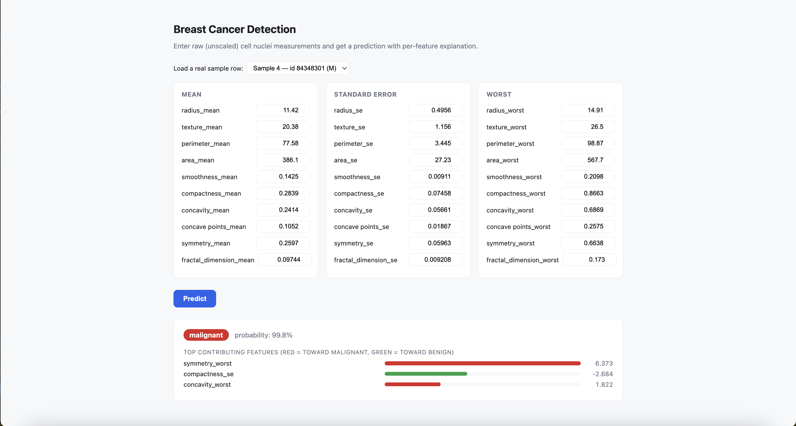

# Breast Cancer Detection — Azure ML project

Data analysis → training → registration → deployment, using the Azure ML
Python SDK v2 against workspace `mlw-cancer-useast2`. The deployed model
serves per-prediction explanations, not just a bare label (see
[Explainability](#explainability)).

## Layout

```
config/environments/train-env.yml   Reference conda spec for the training environment
config/environments/score-env.yml   Conda spec for the deployment's scoring environment
notebooks/01_data_exploration.ipynb  EDA against the breast_cancer_dataset data asset
src/common/ml_client.py              get_ml_client() -- shared workspace connection (reads .env)
src/train/train.py                   Trains a scaler+LogisticRegression pipeline, logs it + feature importance
src/register/register_model.py       Registers a completed run's model into the model registry
src/deploy/score.py                  Custom scoring entry script (init/run) with per-prediction explanations
src/deploy/deploy_endpoint.py        Deploys a registered model to a managed online endpoint
scripts/submit_training.py           Submits the training job to Azure ML
app/server.py, app/index.html        Local browser frontend that calls the deployed endpoint (see below)
tests/test_train.py, tests/test_score.py  Offline unit tests (no AML calls)
```

## One-time setup

```bash
# Use environment.yml, or pip-install into an existing conda env of your own:
conda env create -f environment.yml && conda activate breast-cancer-detection
# --- or, in an existing env ---
pip install azure-ai-ml azure-identity mlflow azureml-mlflow python-dotenv

pip install -e .              # makes `src`/`scripts` importable from anywhere
cp .env.example .env           # fill in AML_SUBSCRIPTION_ID / AML_RESOURCE_GROUP / AML_WORKSPACE_NAME
az login                       # DefaultAzureCredential picks this up
```

`scripts/submit_training.py` currently targets:
- **Data asset**: `breast_cancer_dataset:1` (`uri_file` — a single Kaggle-format CSV)
- **Compute**: `spohane11`
- **Environment**: `aml-cancer-detect@latest` (must already be registered in the
  workspace; `config/environments/train-env.yml` is a reference spec if you
  ever need to (re)create it via `az ml environment create --file
  config/environments/train-env.yml --resource-group <rg> --workspace-name <workspace>`)

If any of those change, edit the constants at the top of `build_job()` in
`scripts/submit_training.py`.

## Workflow

1. **Explore**: run `notebooks/01_data_exploration.ipynb` (already pointed at
   `breast_cancer_dataset:1`) to sanity-check the data.
2. **Train**:
   ```bash
   python scripts/submit_training.py
   ```
   Submits a command job running `src/train/train.py`: fits a
   `StandardScaler` + `LogisticRegression` bundled into a single sklearn
   `Pipeline` (so scaling happens automatically at inference time, not just
   during training) on the `diagnosis` column, with `id`/`Unnamed: 32`
   dropped automatically. Logs the pipeline as an MLflow run artifact under
   `model/`, plus a ranked feature-importance table + bar chart
   (`feature_importance.json`/`.png`, visible in the run's Artifacts tab —
   see [Explainability](#explainability)). Prints the job name, studio URL,
   and the exact `register_model.py` command to run next.
3. **Register**: after checking the run's metrics in the studio,
   ```bash
   python -m src.register.register_model --job_name <job_name_from_step_2>
   ```
   Registers as `breast_cancer_detection_model` by default (`--model_name` to
   override). Training and registration are deliberate separate steps so a
   bad run doesn't automatically get promoted.
4. **Deploy**:
   ```bash
   python -m src.deploy.deploy_endpoint --model_name breast_cancer_detection_model --endpoint_name <your-endpoint-name>
   ```
   Creates a managed online endpoint and deploys `src/deploy/score.py` as a
   *custom* scoring script (not Azure's no-code MLflow path — see
   [Explainability](#explainability) for why). Slow: expect 10–15 min for a
   first-time deployment (image build + VM provisioning). Prints the scoring
   URI once done. **This keeps a VM running (and billing) continuously** —
   delete it when you're done testing (see [Cleanup](#cleanup)).
5. **Test the endpoint**: see [Testing a deployment](#testing-a-deployment).

## Explainability

The model is deliberately kept as `LogisticRegression` because, unlike a
black-box model, its coefficients are directly interpretable math, not an
approximation:

- **Global** (which features matter overall) — `src/train/train.py::log_feature_importance`
  ranks `abs(coefficient)` (valid because every feature is standardized by
  the same scaler) and logs it as an MLflow artifact on each training run.
- **Per-prediction** (why *this* request got its prediction) —
  `src/deploy/score.py::compute_explanation` decomposes the logit into each
  feature's exact contribution (`scaled_value × coefficient`), returned in
  the API response. This is why deployment uses a custom `score.py`/environment
  instead of Azure's simpler no-code MLflow deployment: no-code can only
  return the bare prediction.

## Testing a deployment

Get the scoring URI and an auth key (the `az ml` CLI extension has had
version issues in this environment — the SDK is the reliable path):

```bash
python3 -c "
from src.common.ml_client import get_ml_client
ml_client = get_ml_client()
ep = ml_client.online_endpoints.get('<your-endpoint-name>')
print('scoring_uri:', ep.scoring_uri)
print('key:', ml_client.online_endpoints.get_keys('<your-endpoint-name>').primary_key)
"
```

Then POST all 30 raw (unscaled) feature values — note `concave points_mean`/
`concave points_se`/`concave points_worst` have a literal space, not an
underscore, matching the original Kaggle CSV headers:

```bash
curl -s -X POST "<scoring_uri>" \
  -H "Authorization: Bearer <key>" \
  -H "Content-Type: application/json" \
  -d '{
    "data": [
      {
        "radius_mean": 17.99, "texture_mean": 10.38, "perimeter_mean": 122.8, "area_mean": 1001.0,
        "smoothness_mean": 0.1184, "compactness_mean": 0.2776, "concavity_mean": 0.3001,
        "concave points_mean": 0.1471, "symmetry_mean": 0.2419, "fractal_dimension_mean": 0.07871,
        "radius_se": 1.095, "texture_se": 0.9053, "perimeter_se": 8.589, "area_se": 153.4,
        "smoothness_se": 0.006399, "compactness_se": 0.04904, "concavity_se": 0.05373,
        "concave points_se": 0.01587, "symmetry_se": 0.03003, "fractal_dimension_se": 0.006193,
        "radius_worst": 25.38, "texture_worst": 17.33, "perimeter_worst": 184.6, "area_worst": 2019.0,
        "smoothness_worst": 0.1622, "compactness_worst": 0.6656, "concavity_worst": 0.7119,
        "concave points_worst": 0.2654, "symmetry_worst": 0.4601, "fractal_dimension_worst": 0.1189
      }
    ]
  }'
```

Expected response shape:

```json
[
  {
    "prediction": "malignant",
    "probability": 1.0,
    "top_contributing_features": [
      {"feature": "radius_se", "contribution": 3.096},
      {"feature": "symmetry_worst", "contribution": 2.8872},
      {"feature": "concave points_mean", "contribution": 2.3853}
    ]
  }
]
```

A `{"error": "Missing required feature(s): [...]"}` response means a column
name or spelling is off — the message lists exactly which are missing.

## Local frontend (`app/`)

A small browser UI for the deployed endpoint — 30 input fields (grouped
mean/SE/worst) with a **Predict** button, showing the prediction, probability,
and a bar chart of the top contributing features. A dropdown lets you load 5
real rows from the training data instead of typing values by hand.



```bash
python app/server.py
```

Then open `http://127.0.0.1:8000`. Needs `fastapi`, `uvicorn`, and `requests`
(already in `environment.yml`; `pip install fastapi uvicorn requests` if
you're in an existing env that predates this).

**This can't be a hosted page** — a published Artifact runs under a CSP that
blocks any request to an external host, and a browser calling the Azure
endpoint directly would hit CORS errors anyway (managed online endpoints
don't send CORS headers), plus a client-side page would expose the auth key
to anyone who views source. So `app/server.py` is a tiny local FastAPI server
that sits in between: the browser only ever talks to `localhost`, and the
server — the only thing holding the key — makes the real server-to-server
call to Azure via `requests`. It calls `get_ml_client()` on startup to fetch
the current scoring URI + key for the endpoint named in `ENDPOINT_NAME` at
the top of `app/server.py` (update that constant if you deploy under a
different endpoint name). If the endpoint's been deleted (see
[Cleanup](#cleanup)), startup will fail fetching it — redeploy first.

## Cleanup

Deployment keeps a VM running (and billing) continuously. Delete it via the
SDK (again, more reliable than `az ml` in this environment):

```bash
python3 -c "
from src.common.ml_client import get_ml_client
get_ml_client().online_endpoints.begin_delete('<your-endpoint-name>').result()
"
```

## Known gotchas (learned the hard way)

- **`az ml` CLI extension**: has had repeated version/corruption issues in
  this environment (`Expected 1 module to load starting with 'azext_'`,
  `cannot import name 'get_arm_endpoints'`). When it breaks, it also breaks
  `AzureCliCredential` for *all* `az` commands (the Python SDK shells out to
  `az account get-access-token`), not just `az ml` ones. Fix: `rm -rf
  ~/.azure/cliextensions/ml && az extension add --name ml -y`. The Python
  SDK (`ml_client`) doesn't depend on the `ml` extension at all — prefer it
  over `az ml` commands in this environment.
- **A failed endpoint/deployment must be deleted before retrying**, not just
  re-submitted — Azure returns "failed during initial provisioning and is in
  an unrecoverable state. Delete and re-create." if you try to
  `create_or_update` over one. Deleting is itself slow (can take minutes) and
  quota isn't released until the delete actually *finishes*, not when you
  click Delete.
- **`OutOfQuota` on deployment**: managed online endpoints reserve ~1.2× the
  requested instances' vCPUs (rounds up to a full extra instance at
  `instance_count=1`), and quota is tracked by Azure ML per
  workspace/SKU-family/region — check with
  `ml_client.compute.list_usage(location=...)`, not `az vm list-usage` (that
  checks a different, unrelated quota pool). A stopped compute instance can
  take a while to actually release its quota; deleting it releases it
  immediately.
- **Custom `score.py` deployments need `azureml-inference-server-http`** in
  the conda environment, or the container exits immediately with "A required
  package azureml-inference-server-http is missing." (No-code MLflow
  deployments don't need this — it's specific to custom scoring scripts.)

## Tests

```bash
python -m pytest tests/
```

- `tests/test_train.py`: `load_data` (Kaggle boilerplate column dropping),
  `prepare_features` (diagnosis encoding), `train_and_evaluate` (fit +
  metrics) against synthetic data.
- `tests/test_score.py`: `compute_explanation` against a pipeline trained the
  same way real training does, including a check that the returned
  probability exactly matches `pipeline.predict_proba` and that summed
  contributions reconstruct the model's logit.

No AML/network calls in either file — fully offline.
